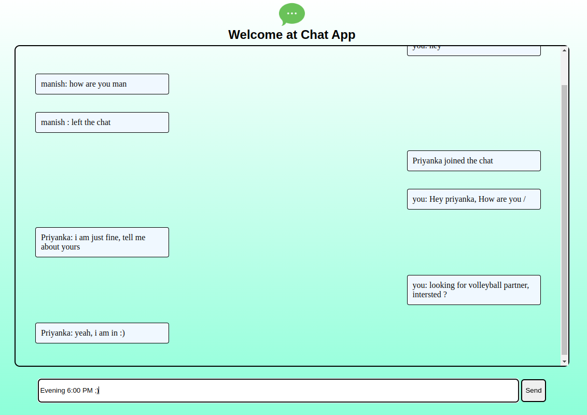
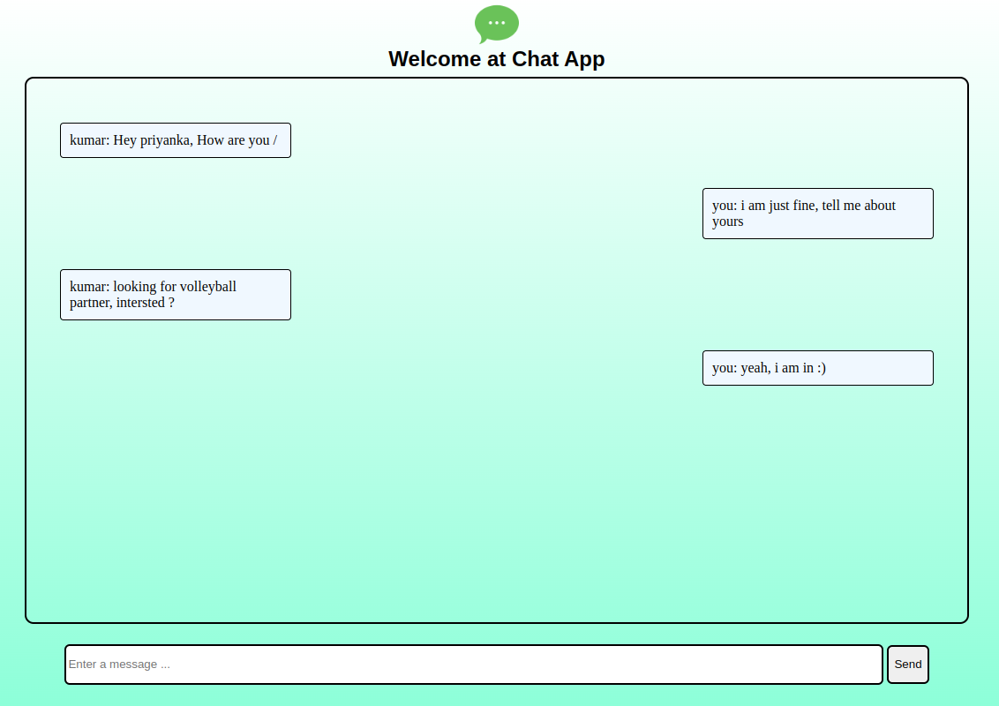

ChatApp
-------
This is a chat app where any one can join by just enter their name





Technology Used
---------------
```diff
+ Backend
  node.js
+ Frontend
  HTML, CSS, JS
```


Install node 18. version
------------------------
```
curl -o- https://raw.githubusercontent.com/nvm-sh/nvm/v0.39.1/install.sh | bash
source ~/.nvm/nvm.sh
nvm install 18
node --version
```


Setup BackEnd
-------------
```
git clone 'ssh git link'
cd nodeServer
npm init
npm i socket.io
npm install -g nodemon
Set-ExecutionPolicy RemoteSigned -Scope CurrentUser
nodemon .\index.js
app started

```

Setup FrontEnd
-------------
```
At index.html
python3 -m http.server 5500
```

